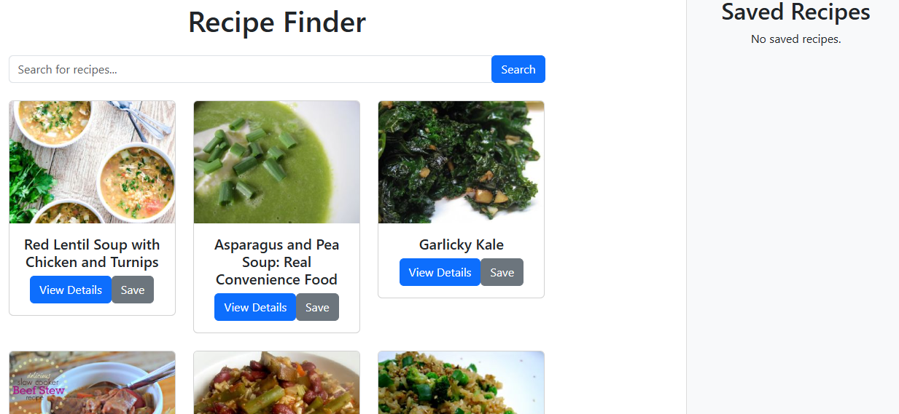
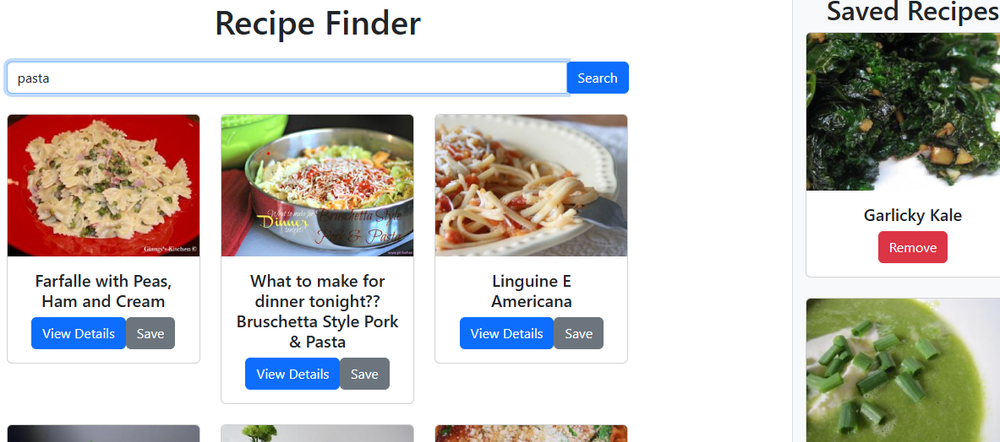
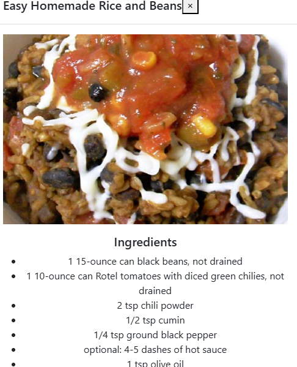
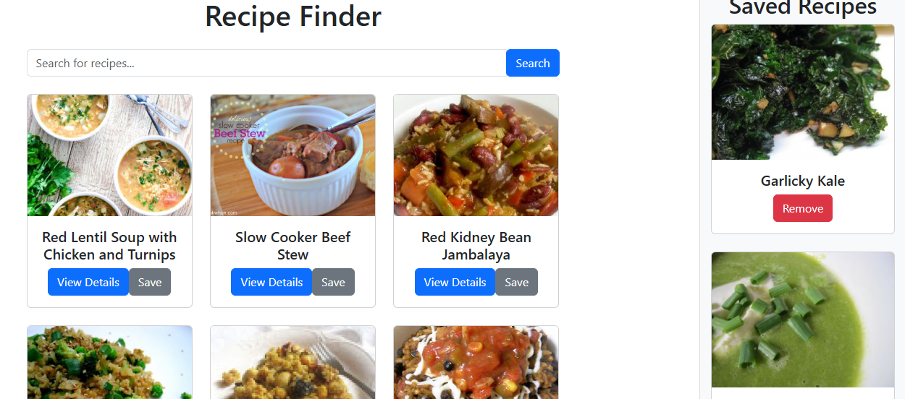

# Recipe Finder

Recipe Finder is a React-based web application designed to help users search for, view, and save recipes from the Spoonacular API. It provides a user-friendly interface for discovering recipes, viewing detailed information, and managing favorite recipes.

## Features

- **Search Recipes**: Search for recipes by name or ingredient.
- **View Details**: See detailed information about each recipe, including ingredients and cooking instructions.
- **Save Recipes**: Save your favorite recipes to view later.
- **Infinite Scrolling**: Automatically load more recipes as you scroll down the page.

## Technologies Used

- React
- Bootstrap
- Spoonacular API
- React Infinite Scroll Component

## Installation Instructions

To get started with Recipe Finder, follow these steps:

1. **Clone the Repository**

   git clone https://github.com/Anjali01012002/recipe-finder.git

2.  **Navigate to the Project Directory**

    cd recipe-finder

3. **Install Dependencies**

    npm install

4. **Create an .env File**

In the root directory of the project, create a file named .env and add your API key:

    REACT_APP_API_KEY=your_api_key_here

Make sure to replace your_api_key_here with your actual API key from Spoonacular.

5. **Start the Development Server**

    npm start

# Output Screenshots

## Architecture

The Recipe Finder application follows a simple architecture:

- **`public/`**: Contains static files such as `index.html`, images, and the favicon.

  - **`assets/`**: Directory for static assets like images.

- **`src/`**: Contains the application's source code.

  - **`components/`**: Contains React components that are used throughout the app.
    
    - **`RecipeCard.js`**: Component to display individual recipe details.
    - **`RecipeDetails.js`**: Component to display detailed information about a selected recipe.
    - **`RecipeList.js`**: Component to display a list of recipes.
    -**`SavedRecipe.js`**: Component to manage and display saved recipes.
    - **`SearchBar.js`**: Component for the search functionality.

  - **`App.js`**: Main component that integrates other components and contains the app's overall layout.

  - **`index.js`**: Entry point that renders the `App` component into the DOM.

  - **`styles.css`**: (Optional) Contains styles for the application.

- **`.gitignore`**: Specifies files and directories to be ignored by Git.

- **`.env`**: Contains environment variables like API keys.

- **`README.md`**: Documentation file with project details, setup instructions, and usage information.

- **`package.json`**: Lists project dependencies and metadata.

- **`package-lock.json`**: Ensures consistent dependency installs.

This architecture allows for modular development and easy maintenance of the application.

## Acknowledgements

- [Spoonacular API](https://spoonacular.com/food-api) for recipe data.
- [React](https://reactjs.org/) for the front-end framework.
- [Bootstrap](https://getbootstrap.com/) for styling.